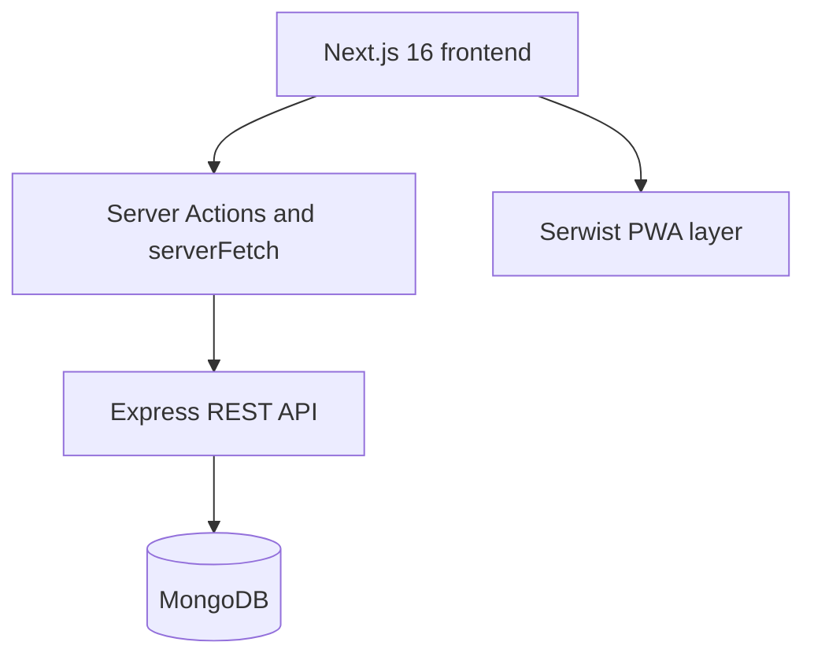

# Mess OS

A full-stack, role-based platform for managing shared-house meals, members, expenses, market duties, billing, and financial reporting.

[Live Application](https://mess-os-client.vercel.app/) · [Product Documentation](https://mess-os-client.vercel.app/docs) · [Backend Repository](https://github.com/nurulla-hasan/mess_os_server)

> **Status:** Active personal project. This repository contains the Next.js frontend; the REST API is maintained in a separate public repository.

## Overview

In Bangladesh, a “mess” is a shared living arrangement where residents coordinate meals, grocery duties, and common expenses. Mess OS brings those workflows into one responsive application for members, managers, and platform administrators.

The product combines daily meal operations with live financial visibility, structured approval workflows, AI-assisted shopping support, and installable PWA behavior.

## Key Features

### Meal and member operations

- Role-based dashboards for members, mess managers, and super administrators
- Member onboarding, approval, participation, and profile workflows
- Daily meal logs, dynamic meal categories, and meal-off requests
- Menu planning, notices, complaints, and notifications

### Finance and billing

- Expense and payment submission with manager approval workflows
- Monthly billing cycles, member invoices, and detailed bill views
- Live member balances and mid-month estimated meal charges
- Estimated meal-rate calculation from approved expenses and meal totals
- Financial summaries, statements, and expense/payment reports

### Market and AI-assisted workflows

- Market-duty scheduling and manager-maintained market prices
- AI-assisted shopping-list generation for market schedules
- Global page-aware help chat with user-linked conversation history

### Product experience

- Responsive interfaces for desktop, tablet, and mobile
- Installable PWA powered by Serwist with an offline fallback
- Multiple light and dark themes
- Reusable data tables, filters, forms, modals, and dashboard components

## Role Overview

| Role | Main capabilities |
| --- | --- |
| Member | Track meals, request meal pauses, submit payments, view bills and balances, and access notices |
| Mess Manager | Manage members, meals, expenses, payments, menus, market schedules, billing cycles, and reports |
| Super Admin | Manage users, messes, subscriptions, feature access, and platform-level operations |

## Engineering Highlights

- Built with the Next.js App Router, Server Components, and Server Actions
- Uses a server-only API layer for access-token refresh, secure cookie persistence, cache tags, invalidation, and JSON/text responses
- Applies React Hook Form and Zod for reusable, validated form workflows
- Uses Zustand for client-side state and TanStack Table for data-heavy management screens
- Adds PWA precaching, runtime caching, navigation preload, and offline fallback through Serwist
- Keeps the interface reusable through shared dashboard, table, filter, modal, and theme primitives

## Architecture



## Tech Stack

| Area | Technologies |
| --- | --- |
| Core | Next.js 16, React 19, TypeScript |
| UI | Tailwind CSS 4, shadcn/ui, Radix UI, Lucide React, Recharts |
| State and forms | Zustand, React Hook Form, Zod |
| Data interfaces | TanStack Table, Server Components, Server Actions |
| PWA | Serwist |
| Backend | Node.js, Express.js, MongoDB, Mongoose, JWT |
| Deployment | Vercel |

## Related Repositories

- **Frontend:** [nurulla-hasan/mess_os_client](https://github.com/nurulla-hasan/mess_os_client)
- **Backend API:** [nurulla-hasan/mess_os_server](https://github.com/nurulla-hasan/mess_os_server)

## Getting Started

### Prerequisites

- Node.js 20 or newer
- npm
- A running Mess OS backend

### Installation

```bash
git clone https://github.com/nurulla-hasan/mess_os_client.git
cd mess_os_client
npm install
```

Create `.env.local` and point the frontend to the API:

```env
NEXT_PUBLIC_BASE_API=your_backend_api_base_url
```

Start the development server:

```bash
npm run dev
```

Open [http://localhost:3000](http://localhost:3000).

## Available Scripts

| Command | Purpose |
| --- | --- |
| `npm run dev` | Start the development server |
| `npm run build` | Create a production build |
| `npm run start` | Start the production server |
| `npm run lint` | Run ESLint |

## Author

Developed by [Nurulla Hasan](https://github.com/nurulla-hasan).

